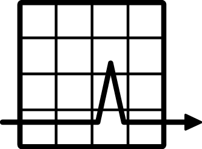

---
# Feel free to add content and custom Front Matter to this file.
# To modify the layout, see https://jekyllrb.com/docs/themes/#overriding-theme-defaults

layout: default
---
# {{ site.title }}
<h3 id="project_description">{{ site.description }}</h3>

    

        

            

                
            

            <h3>Distributed</h3>
        

        Drive the load from many nodes.
    

    

        

            

                <!-- Fix me if you know CSS -->
                
            

            <h3>Accurate</h3>
        

        All operations are async to avoid the <a href="https://www.azul.com/files/HowNotToMeasureLatency_LLSummit_NYC_12Nov2013.pdf">coordinated-omission fallacy</a>.
    

    

        

            

                
            

            <h3>Versatile</h3>
        

        You can express complex scenarios either in YAML or through pluggable steps.
    

    

        

            

                
            

            <h3>Low-allocation</h3>
        

        Internally we try to allocate as little as possible on the critical code paths to not let garbage-collector disturb the operations.
    

Hyperfoil is licensed under [Apache License 2.0](http://www.apache.org/licenses/LICENSE-2.0)
